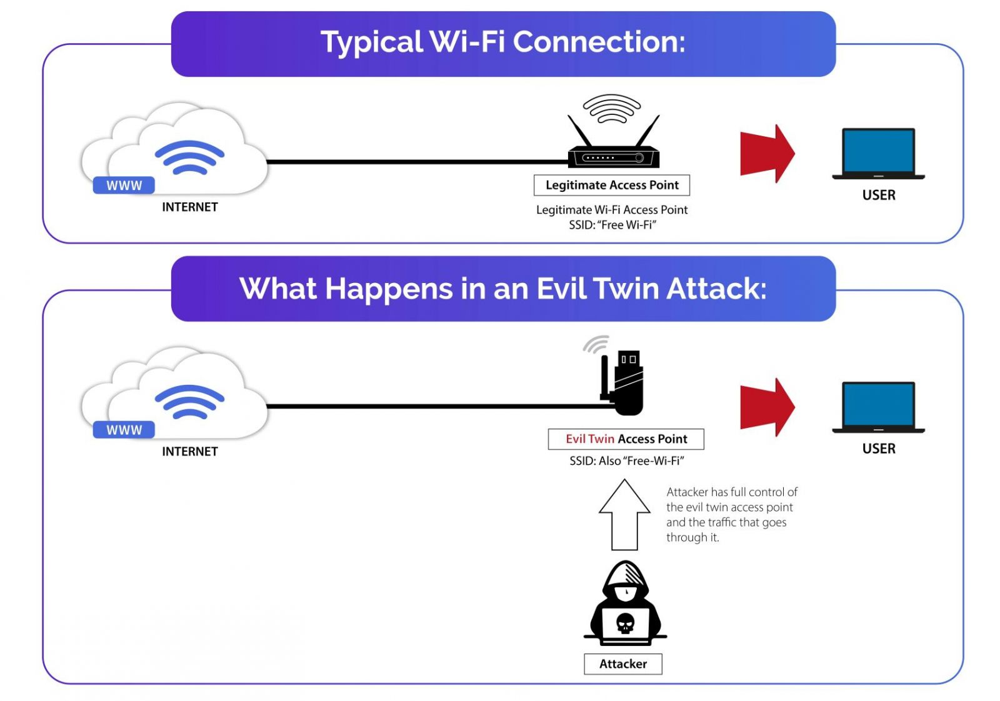

# 💀  <strong>Evil twin attack</strong>  💀
Evil Twin attack python implementation

## <strong>Demonstration</strong> (Attacker  -  Victim):

#### Visual explication:

 

### Hardware:
💻 Laptop  
📡 Network Card - TP_Link Archer T4U - Which allows to use moniter mode 
⚡Operation system: Debian-based linux flavor  

### Requirements
install the requirements in the [requirements.txt file](https://github.com/ShmuelLa/Evil-Twin/blob/main/requirements.txt)
and run the following : 
sudo apt install dnsmasq dhcpcd5 hostapd automake libtool gengetopt dsniff
 
### Explaination:
For this assignement we created hacking tool based on the "evil-twin attack" concept. 
An evil twin is a fraudulent Wi-Fi access point that appears to be legitimate for the user but is set up to eavesdrop on wireless communications.
The evil twin is the wireless LAN equivalent of the phising scam cyberattacks. 
This type of attack is used to steal unsuspecting users passwords, or personal information, either by monitoring their logins or through phishing, which consists of creating a fraudulent website and luring people to it.

### Method
The attacker snoops on Internet traffic using a wireless access point.
The "victims" can be any AP around (Wifi access point). Also the mission was besides attack also create a defence against this attack. This tool is mainly target open public wifi networks. Our victim will think he is fine and have full access to interenet but he doesn't he logged in malicious hotspot. From here, you can do alot of things - for example to add bitcoin miner to each request, find a way to make client download malicious script and get full access to his computer and so on..

# Overview of the attack.
1. Run [main.py](https://github.com/ShmuelLa/Evil-Twin/blob/main/main.py)

    * You will be prompted to choose a network interface to perform the attack from. Note that the network adapter must be capable of swtiching to monitor mode
    * This will also open up a second interface on the adapter, to enable us to use the same network adapter for both acting as an AP, and performing the attack itself.
    
2. From the menu, chose the option to scan for victims - this will perform a scan that takes approximatly 1 minute, which scans for available, nearby APs.
    * Once the scan is complete, choose from the list of available networks the one you want to attack. This will be the network which we will be impersonating. 
    * A scan will begin once more, which should take approximatly 1 mintue to scan for all clients connected to the network. once the scan is complete choose a client you want to attack.
    

3. After an AP and an appropriate client has been chosen, the attack will commence. 
    * This will call a series of shell scripts which configure the fake AP, [setting IP tables](https://github.com/ShmuelLa/Evil-Twin/blob/0ff416103d631cf7f42cc7a67206476ae3499d28/utils.py#L161), [Netmask](https://github.com/ShmuelLa/Evil-Twin/blob/0ff416103d631cf7f42cc7a67206476ae3499d28/utils.py#L140), [Hostapd configurations](https://github.com/ShmuelLa/Evil-Twin/blob/0ff416103d631cf7f42cc7a67206476ae3499d28/utils.py#L80),[dnsmasq configurations](https://github.com/ShmuelLa/Evil-Twin/blob/main/config/dns.conf), and setting up and [apache2 server](https://github.com/ShmuelLa/Evil-Twin/blob/0ff416103d631cf7f42cc7a67206476ae3499d28/utils.py#L62) which will host our captive portal.
    * after the fake AP has been set up, and is running, we will disconnect the selected client from the AP he is connected to using a [Deauthentication Attack](https://github.com/ShmuelLa/Evil-Twin/blob/main/attack.py)
4. After the client has been disconnected, he will try to reconnect to our fake AP. 
    * This will open up a the captive portal that is hosted on our apache2 server.
    * The user will *not* be  able to browse the web unless he enters a password and username. His credentials will be saved to a file in our system.
    
5. After submitting the credentials, the user will be able to browse uninterrupted.

# Defence

1. Run [main.py](https://github.com/ShmuelLa/Evil-Twin/blob/main/main.py)
    * pick a network interface that is able to switch to monitor mode.
    * This will prevent the interface from being attacked.
    
2. Run one of our defensne modules, each one acts a little differently
    * [The first](https://github.com/ShmuelLa/Evil-Twin/blob/main/defence_v0.py) runs a scan from approximately once minute.   This will search for any APs who have the same name. If they any are found, it will begin to send deauthentication packets from all clients to the AP, and from the AP to all clients. *Note this will cause deauthentication packets for BOTH APs, as unless the MAC address of the real AP is saved beforehand, it is impossible to differentiate between the networks.*
     Note: This module must be ran after the fake AP has been raised, or in real time, since the scan is time-bound. it will detect fake APs, but may also detect false positives.
    * [The second](https://github.com/ShmuelLa/Evil-Twin/blob/main/defence_v3.py) works in a simillar matter, but instead of sending deauthenticaion packets and disconnecting users - it instead performs a DDoS attack on the duplicate APs
    * [The third](https://github.com/ShmuelLa/Evil-Twin/blob/main/defence_v1.py) is an active scan that is not time bound, it alerts the user in the console once it detects an attack. it detects a flood of deauthentication packets, and / or SSID spoofing and alerts the user.

# Discussion:

### The captive portal:
After setting up the apache2 server, and hosting it locally, the template of the portal must be put in the /var/www/html/ directory.
To get the captive portal to instantly open once the user access the fake AP, we had to edit the [dns.conf](https://github.com/ShmuelLa/Evil-Twin/blob/main/config/dns.conf) file to include the line address=<ip> of where the Apache server is hosted, this causes all requests through the AP to be redirected to this server.
This is why the user can not browse until he submits credentials - Once he submits, we edit the [dns.conf](https://github.com/ShmuelLa/Evil-Twin/blob/main/config/dns.conf) file and remove the address line, which causes requests to be redirected normally.
 
 
### NetworkManager 
 The interface you choose must be set to unmanaged mode in the NetworkManager service, unless this is performed, the serivce will control the interface and you users will not be able to access the internet through your fake ap